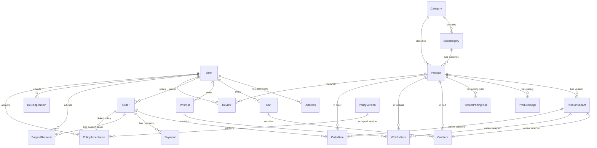

# Aurelia Fine Piercing Jewelry — Database Architecture & Schema Specification

**Document Version:** 1.0  
**Target Platform:** Dual E-Commerce Retail & B2B Wholesale Platform  
**ORM / Database Stack:** Prisma ORM, Node.js (Express), SQLite (Development) / PostgreSQL (Production Compatible)  
**Security & Compliance:** Strict Hygiene No-Return & No-Refund Policy Audit Trail, Role-Based Access Control (RBAC), Automated Backup & Disaster Recovery  

---

## 🏛️ Executive Architecture Overview

The **Aurelia Fine Piercing Jewelry** platform utilizes a normalized, relational database schema designed to seamlessly support both high-volume retail customers and B2B wholesale buyers under a unified backend infrastructure.

### Key Architectural Pillars:
1. **Dual-Storefront Architecture**: Unified product catalog with visibility rules (`RETAIL`, `B2B`, `BOTH`), Minimum Order Quantity (`MOQ`), and customer-type-specific tier pricing (`b2bPrice`, `ProductPricingRule`).
2. **Strict No Return & No Refund Policy Audit Trail**: Enforces default product hygiene flags (`returnable: false`, `refundable: false`) and persists explicit policy acceptance snapshots (`PolicyAcceptance`, `PolicyVersion`) storing user IP address, timestamp, and order linkage.
3. **B2B Wholesale Lifecycle Management**: Dedicated workflow for wholesale registration (`B2BApplication`), GSTIN validation, and approval status transitions (`PENDING`, `APPROVED`, `REJECTED`, `SUSPENDED`).
4. **Exceptional Case Support System**: Dedicated ticket intake system (`SupportRequest`) for damaged, lost, or defective shipments, bypassing standard returns with admin remedies (`Replacement`, `Store Credit`, `Manual Refund Exception`).
5. **Disaster Recovery & Data Safety**: Automated 24-hour scheduled database snapshot scheduler (`backupScheduler.js`) + manual export/import system with SHA-256 integrity checksums and foreign-key-safe transactional restoration.

---

## 📊 Entity Relationship Diagram (ERD)

---

## 📋 Comprehensive Table Specifications (22 Models)

---

### 1. `User`
Stores system accounts for administrators, retail customers, and B2B wholesale buyers.

| Column Name | Data Type | Constraints | Default Value | Description |
| :--- | :--- | :--- | :--- | :--- |
| `id` | `String (UUID)` | `PRIMARY KEY` | `uuid()` | Unique user account ID |
| `email` | `String` | `UNIQUE, NOT NULL` | — | User email address (Login credential) |
| `passwordHash` | `String` | `NOT NULL` | — | Bcrypt hashed password |
| `name` | `String` | `NOT NULL` | — | Full name of user |
| `phone` | `String` | `NULLABLE` | `null` | Contact telephone number |
| `role` | `String` | `NOT NULL` | `'RETAIL_CUSTOMER'` | `SUPER_ADMIN`, `STAFF_ADMIN`, `RETAIL_CUSTOMER`, `B2B_CUSTOMER` |
| `b2bApprovalStatus` | `String` | `NULLABLE` | `null` | `PENDING`, `APPROVED`, `REJECTED`, `SUSPENDED` |
| `companyName` | `String` | `NULLABLE` | `null` | Business entity name (B2B) |
| `gstNumber` | `String` | `NULLABLE` | `null` | GSTIN tax identification (B2B) |
| `businessType` | `String` | `NULLABLE` | `null` | Retail Studio, Piercing Parlor, Distributor |
| `expectedVolume` | `String` | `NULLABLE` | `null` | Expected monthly order volume tier |
| `createdAt` | `DateTime` | `NOT NULL` | `now()` | Timestamp of registration |
| `updatedAt` | `DateTime` | `NOT NULL` | `updatedAt` | Timestamp of last account edit |

---

### 2. `Address`
Saved customer shipping and billing addresses.

| Column Name | Data Type | Constraints | Default Value | Description |
| :--- | :--- | :--- | :--- | :--- |
| `id` | `String (UUID)` | `PRIMARY KEY` | `uuid()` | Unique address ID |
| `userId` | `String (UUID)` | `FOREIGN KEY (User)` | — | Owner user ID (Cascades on delete) |
| `addressType` | `String` | `NOT NULL` | `'Home'` | `Home`, `Office`, `Studio`, `Warehouse` |
| `fullName` | `String` | `NOT NULL` | — | Recipient full name |
| `phone` | `String` | `NOT NULL` | — | Delivery contact phone |
| `addressLine1` | `String` | `NOT NULL` | — | Street address, building |
| `addressLine2` | `String` | `NULLABLE` | `null` | Suite, unit, landmark |
| `city` | `String` | `NOT NULL` | — | City name |
| `state` | `String` | `NOT NULL` | — | State / Province |
| `country` | `String` | `NOT NULL` | `'India'` | Country name |
| `postalCode` | `String` | `NOT NULL` | — | PIN / ZIP Code |
| `isDefault` | `Boolean` | `NOT NULL` | `false` | Primary default address indicator |
| `createdAt` | `DateTime` | `NOT NULL` | `now()` | Address creation timestamp |

---

### 3. `Category`
Top-level jewelry catalog categories (e.g. Nose Rings & Septum, Ear Piercing, Belly Rings).

| Column Name | Data Type | Constraints | Default Value | Description |
| :--- | :--- | :--- | :--- | :--- |
| `id` | `String (UUID)` | `PRIMARY KEY` | `uuid()` | Category ID |
| `name` | `String` | `NOT NULL` | — | Category title |
| `slug` | `String` | `UNIQUE, NOT NULL` | — | URL-friendly slug (e.g., `nose-rings`) |
| `description` | `String` | `NULLABLE` | `null` | Category summary |
| `image` | `String` | `NULLABLE` | `null` | Banner image URL |
| `status` | `String` | `NOT NULL` | `'ACTIVE'` | `ACTIVE`, `INACTIVE` |
| `createdAt` | `DateTime` | `NOT NULL` | `now()` | Category creation date |

---

### 4. `Subcategory`
Hierarchical subcategories linked to a parent category (e.g., Septum Clickers under Nose Rings).

| Column Name | Data Type | Constraints | Default Value | Description |
| :--- | :--- | :--- | :--- | :--- |
| `id` | `String (UUID)` | `PRIMARY KEY` | `uuid()` | Subcategory ID |
| `categoryId` | `String (UUID)` | `FOREIGN KEY (Category)` | — | Parent Category ID (Cascades on delete) |
| `name` | `String` | `NOT NULL` | — | Subcategory title |
| `slug` | `String` | `UNIQUE, NOT NULL` | — | URL slug |
| `description` | `String` | `NULLABLE` | `null` | Subcategory description |
| `status` | `String` | `NOT NULL` | `'ACTIVE'` | `ACTIVE`, `INACTIVE` |
| `createdAt` | `DateTime` | `NOT NULL` | `now()` | Subcategory creation date |

---

### 5. `Product`
Core jewelry product master table supporting dual pricing, stock, visibility, and hygiene flags.

| Column Name | Data Type | Constraints | Default Value | Description |
| :--- | :--- | :--- | :--- | :--- |
| `id` | `String (UUID)` | `PRIMARY KEY` | `uuid()` | Product ID |
| `categoryId` | `String (UUID)` | `FOREIGN KEY (Category)` | — | Parent Category ID |
| `subcategoryId` | `String (UUID)` | `FOREIGN KEY (Subcategory)` | `null` | Optional Subcategory ID |
| `name` | `String` | `NOT NULL` | — | Product title |
| `slug` | `String` | `UNIQUE, NOT NULL` | — | URL slug |
| `sku` | `String` | `UNIQUE, NOT NULL` | — | Master Stock Keeping Unit |
| `description` | `String` | `NOT NULL` | — | Detailed HTML/Text product description |
| `retailPrice` | `Float` | `NOT NULL` | — | Standard retail MSRP (₹) |
| `salePrice` | `Float` | `NULLABLE` | `null` | Promotional retail price (₹) |
| `b2bPrice` | `Float` | `NULLABLE` | `null` | Wholesale unit price (₹) |
| `stock` | `Int` | `NOT NULL` | `0` | Available physical inventory count |
| `moq` | `Int` | `NOT NULL` | `1` | Minimum Order Quantity (B2B) |
| `visibility` | `String` | `NOT NULL` | `'BOTH'` | `RETAIL`, `B2B`, `BOTH` |
| `returnable` | `Boolean` | `NOT NULL` | `false` | Hygiene No-Return policy flag |
| `refundable` | `Boolean` | `NOT NULL` | `false` | Hygiene No-Refund policy flag |
| `exceptionalReviewEnabled` | `Boolean` | `NOT NULL` | `true` | Allows exceptional issue ticket submission |
| `careInstructions` | `String` | `NULLABLE` | `null` | Sterilization and care guidelines |
| `hygieneNotice` | `String` | `NULLABLE` | `null` | Mandatory hygiene notice for body jewelry |
| `status` | `String` | `NOT NULL` | `'ACTIVE'` | `ACTIVE`, `INACTIVE` |
| `createdAt` | `DateTime` | `NOT NULL` | `now()` | Product creation date |
| `updatedAt` | `DateTime` | `NOT NULL` | `updatedAt` | Last modification date |

---

### 6. `ProductVariant`
Variants per product (e.g. Size: 16G / Material: 14K Gold, Solid Titanium).

| Column Name | Data Type | Constraints | Default Value | Description |
| :--- | :--- | :--- | :--- | :--- |
| `id` | `String (UUID)` | `PRIMARY KEY` | `uuid()` | Variant ID |
| `productId` | `String (UUID)` | `FOREIGN KEY (Product)` | — | Parent Product ID (Cascades on delete) |
| `name` | `String` | `NOT NULL` | — | Variant attribute name (e.g., Size, Material) |
| `value` | `String` | `NOT NULL` | — | Attribute value (e.g., 16G, Titanium G23) |
| `priceAdjustment` | `Float` | `NOT NULL` | `0.0` | Price delta (+/- ₹) |
| `stock` | `Int` | `NOT NULL` | `0` | Variant specific stock count |
| `sku` | `String` | `UNIQUE, NOT NULL` | — | Unique SKU for variant |
| `returnable` | `Boolean` | `NOT NULL` | `false` | Hygiene flag |
| `refundable` | `Boolean` | `NOT NULL` | `false` | Hygiene flag |

---

### 7. `ProductImage`
Image gallery URLs per product with display ordering.

| Column Name | Data Type | Constraints | Default Value | Description |
| :--- | :--- | :--- | :--- | :--- |
| `id` | `String (UUID)` | `PRIMARY KEY` | `uuid()` | Image record ID |
| `productId` | `String (UUID)` | `FOREIGN KEY (Product)` | — | Parent Product ID (Cascades on delete) |
| `imageUrl` | `String` | `NOT NULL` | — | Absolute image file URL |
| `displayOrder` | `Int` | `NOT NULL` | `0` | Gallery sequence index (0 = Main thumbnail) |

---

### 8. `ProductPricingRule`
Tiered volume discount pricing rules for B2B wholesale orders.

| Column Name | Data Type | Constraints | Default Value | Description |
| :--- | :--- | :--- | :--- | :--- |
| `id` | `String (UUID)` | `PRIMARY KEY` | `uuid()` | Pricing rule ID |
| `productId` | `String (UUID)` | `FOREIGN KEY (Product)` | — | Parent Product ID (Cascades on delete) |
| `customerType` | `String` | `NOT NULL` | `'B2B'` | Target customer classification |
| `minimumQuantity` | `Int` | `NOT NULL` | `1` | Tier volume threshold (e.g., 50+ units) |
| `price` | `Float` | `NOT NULL` | — | Discounted unit price (₹) |
| `discountPercentage` | `Float` | `NULLABLE` | `null` | Percentage discount |

---

### 9. `Cart`
Shopping carts active per user session or registered user.

| Column Name | Data Type | Constraints | Default Value | Description |
| :--- | :--- | :--- | :--- | :--- |
| `id` | `String (UUID)` | `PRIMARY KEY` | `uuid()` | Cart ID |
| `userId` | `String (UUID)` | `FOREIGN KEY (User)` | `null` | Associated user ID (Cascades on delete) |
| `sessionId` | `String` | `NULLABLE` | `null` | Guest session tracking key |
| `platform` | `String` | `NOT NULL` | `'RETAIL'` | `RETAIL`, `B2B` |
| `createdAt` | `DateTime` | `NOT NULL` | `now()` | Creation date |
| `updatedAt` | `DateTime` | `NOT NULL` | `updatedAt` | Cart modification timestamp |

---

### 10. `CartItem`
Individual line items inside a cart.

| Column Name | Data Type | Constraints | Default Value | Description |
| :--- | :--- | :--- | :--- | :--- |
| `id` | `String (UUID)` | `PRIMARY KEY` | `uuid()` | Cart line item ID |
| `cartId` | `String (UUID)` | `FOREIGN KEY (Cart)` | — | Parent Cart ID (Cascades on delete) |
| `productId` | `String (UUID)` | `FOREIGN KEY (Product)` | — | Target Product ID |
| `variantId` | `String (UUID)` | `FOREIGN KEY (ProductVariant)` | `null` | Selected variant ID |
| `quantity` | `Int` | `NOT NULL` | `1` | Quantity added |
| `unitPrice` | `Float` | `NOT NULL` | — | Effective price per unit (₹) |

---

### 11. `Wishlist`
Customer saved wishlist containers.

| Column Name | Data Type | Constraints | Default Value | Description |
| :--- | :--- | :--- | :--- | :--- |
| `id` | `String (UUID)` | `PRIMARY KEY` | `uuid()` | Wishlist ID |
| `userId` | `String (UUID)` | `FOREIGN KEY (User)` | — | Owner user ID (Cascades on delete) |
| `createdAt` | `DateTime` | `NOT NULL` | `now()` | Wishlist creation date |

---

### 12. `WishlistItem`
Saved products inside user wishlist.

| Column Name | Data Type | Constraints | Default Value | Description |
| :--- | :--- | :--- | :--- | :--- |
| `id` | `String (UUID)` | `PRIMARY KEY` | `uuid()` | Item ID |
| `wishlistId` | `String (UUID)` | `FOREIGN KEY (Wishlist)` | — | Parent Wishlist ID (Cascades on delete) |
| `productId` | `String (UUID)` | `FOREIGN KEY (Product)` | — | Target Product ID |
| `variantId` | `String (UUID)` | `FOREIGN KEY (ProductVariant)` | `null` | Target Variant ID |
| `createdAt` | `DateTime` | `NOT NULL` | `now()` | Saved date |

---

### 13. `Order`
Master order record containing financial breakdown, shipping tracking, policy agreement, and status flow.

| Column Name | Data Type | Constraints | Default Value | Description |
| :--- | :--- | :--- | :--- | :--- |
| `id` | `String (UUID)` | `PRIMARY KEY` | `uuid()` | Order ID |
| `userId` | `String (UUID)` | `FOREIGN KEY (User)` | `null` | Customer user ID |
| `platform` | `String` | `NOT NULL` | `'RETAIL'` | `RETAIL`, `B2B` |
| `orderNumber` | `String` | `UNIQUE, NOT NULL` | — | Unique readable order number (e.g. `ORD-17886...`) |
| `subtotal` | `Float` | `NOT NULL` | — | Items gross subtotal (₹) |
| `discount` | `Float` | `NOT NULL` | `0.0` | Coupon discount applied (₹) |
| `shippingCharge` | `Float` | `NOT NULL` | `0.0` | Delivery fee (₹) |
| `tax` | `Float` | `NOT NULL` | `0.0` | GST tax amount (₹) |
| `totalAmount` | `Float` | `NOT NULL` | — | Final net total payable (₹) |
| `paymentStatus` | `String` | `NOT NULL` | `'Pending'` | `Pending`, `Authorized`, `Paid`, `Failed`, `Refunded` |
| `orderStatus` | `String` | `NOT NULL` | `'Pending'` | `Pending`, `Confirmed`, `Processing`, `Packed`, `Shipped`, `Delivered`, `Cancelled` |
| `shippingStatus` | `String` | `NOT NULL` | `'Not Shipped'` | `Not Shipped`, `Processing`, `Packed`, `Shipped`, `Delivered` |
| `shippingAddressJson` | `String` | `NOT NULL` | — | Immutable JSON snapshot of shipping address |
| `billingAddressJson` | `String` | `NULLABLE` | `null` | Immutable JSON snapshot of billing address |
| `trackingNumber` | `String` | `NULLABLE` | `null` | Courier tracking number |
| `policyVersion` | `String` | `NOT NULL` | `'1.0'` | Accepted No-Return policy version |
| `policyAccepted` | `Boolean` | `NOT NULL` | `true` | Policy acceptance verification flag |
| `policyAcceptedAt` | `DateTime` | `NOT NULL` | `now()` | Timestamp of mandatory policy check at checkout |
| `policyAcceptedIp` | `String` | `NULLABLE` | `null` | Client IP address during checkout |
| `createdAt` | `DateTime` | `NOT NULL` | `now()` | Order placement date |
| `updatedAt` | `DateTime` | `NOT NULL` | `updatedAt` | Order update date |

---

### 14. `OrderItem`
Line items attached to a placed order.

| Column Name | Data Type | Constraints | Default Value | Description |
| :--- | :--- | :--- | :--- | :--- |
| `id` | `String (UUID)` | `PRIMARY KEY` | `uuid()` | Order item ID |
| `orderId` | `String (UUID)` | `FOREIGN KEY (Order)` | — | Parent Order ID (Cascades on delete) |
| `productId` | `String (UUID)` | `FOREIGN KEY (Product)` | — | Purchased Product ID |
| `variantId` | `String (UUID)` | `FOREIGN KEY (ProductVariant)` | `null` | Purchased Variant ID |
| `productName` | `String` | `NOT NULL` | — | Snapshot product name |
| `sku` | `String` | `NOT NULL` | — | Snapshot SKU |
| `quantity` | `Int` | `NOT NULL` | — | Purchased quantity |
| `unitPrice` | `Float` | `NOT NULL` | — | Unit price at purchase time (₹) |
| `totalPrice` | `Float` | `NOT NULL` | — | Line item subtotal (`quantity * unitPrice`) |

---

### 15. `Payment`
Payment gateway transactions (Razorpay / Gateway Integrations).

| Column Name | Data Type | Constraints | Default Value | Description |
| :--- | :--- | :--- | :--- | :--- |
| `id` | `String (UUID)` | `PRIMARY KEY` | `uuid()` | Payment record ID |
| `orderId` | `String (UUID)` | `FOREIGN KEY (Order)` | — | Parent Order ID (Cascades on delete) |
| `gateway` | `String` | `NOT NULL` | `'Razorpay'` | Gateway provider name |
| `transactionId` | `String` | `NULLABLE` | `null` | Payment gateway transaction ID |
| `amount` | `Float` | `NOT NULL` | — | Transaction amount (₹) |
| `status` | `String` | `NOT NULL` | `'Created'` | `Created`, `Authorized`, `Captured`, `Failed`, `Refunded` |
| `paymentMethod` | `String` | `NULLABLE` | `null` | `UPI`, `Credit Card`, `NetBanking`, `Wallet` |
| `responseData` | `String` | `NULLABLE` | `null` | Raw gateway response JSON payload |
| `createdAt` | `DateTime` | `NOT NULL` | `now()` | Payment timestamp |

---

### 16. `Coupon`
Promotional discount coupons for retail or B2B platforms.

| Column Name | Data Type | Constraints | Default Value | Description |
| :--- | :--- | :--- | :--- | :--- |
| `id` | `String (UUID)` | `PRIMARY KEY` | `uuid()` | Coupon ID |
| `code` | `String` | `UNIQUE, NOT NULL` | — | Uppercase coupon code (e.g. `AURELIA10`) |
| `discountType` | `String` | `NOT NULL` | `'PERCENTAGE'` | `PERCENTAGE`, `FIXED` |
| `discountValue` | `Float` | `NOT NULL` | — | Percentage or fixed rupee discount value |
| `minimumOrderValue` | `Float` | `NOT NULL` | `0.0` | Minimum order amount threshold |
| `maximumDiscount` | `Float` | `NULLABLE` | `null` | Max discount cap (₹) |
| `usageLimit` | `Int` | `NULLABLE` | `null` | Total allowed redemptions |
| `usedCount` | `Int` | `NOT NULL` | `0` | Current redemption count |
| `startDate` | `DateTime` | `NULLABLE` | `null` | Validity start timestamp |
| `endDate` | `DateTime` | `NULLABLE` | `null` | Validity expiration timestamp |
| `platform` | `String` | `NOT NULL` | `'ALL'` | `RETAIL`, `B2B`, `ALL` |
| `status` | `String` | `NOT NULL` | `'ACTIVE'` | `ACTIVE`, `INACTIVE` |
| `createdAt` | `DateTime` | `NOT NULL` | `now()` | Creation date |

---

### 17. `Review`
Verified customer product ratings and reviews.

| Column Name | Data Type | Constraints | Default Value | Description |
| :--- | :--- | :--- | :--- | :--- |
| `id` | `String (UUID)` | `PRIMARY KEY` | `uuid()` | Review ID |
| `userId` | `String (UUID)` | `FOREIGN KEY (User)` | — | Reviewer user ID |
| `productId` | `String (UUID)` | `FOREIGN KEY (Product)` | — | Target Product ID |
| `orderId` | `String (UUID)` | `NULLABLE` | `null` | Verified purchase order ID |
| `rating` | `Int` | `NOT NULL` | — | Star rating (1 to 5) |
| `comment` | `String` | `NOT NULL` | — | Customer review text |
| `status` | `String` | `NOT NULL` | `'PENDING'` | Moderation status: `PENDING`, `APPROVED`, `REJECTED` |
| `createdAt` | `DateTime` | `NOT NULL` | `now()` | Review submission date |

---

### 18. `SupportRequest`
Exceptional case support tickets replacing standard returns for damaged or defective body jewelry.

| Column Name | Data Type | Constraints | Default Value | Description |
| :--- | :--- | :--- | :--- | :--- |
| `id` | `String (UUID)` | `PRIMARY KEY` | `uuid()` | Support Ticket ID |
| `orderId` | `String (UUID)` | `FOREIGN KEY (Order)` | — | Associated Order ID |
| `userId` | `String (UUID)` | `FOREIGN KEY (User)` | — | Submitter User ID |
| `requestType` | `String` | `NOT NULL` | `'EXCEPTIONAL_ISSUE'` | `DEFECTIVE`, `DAMAGED`, `WRONG_ITEM`, `LOST_IN_TRANSIT` |
| `reason` | `String` | `NOT NULL` | — | Issue summary reason |
| `description` | `String` | `NOT NULL` | — | Detailed problem description |
| `attachmentUrls` | `String` | `NULLABLE` | `null` | JSON array of photo evidence URLs |
| `status` | `String` | `NOT NULL` | `'Submitted'` | `Submitted`, `Under Review`, `Approved Exceptional Case`, `Rejected Under Policy`, `Replacement Approved`, `Store Credit Approved`, `Refund Approved`, `Resolved` |
| `approvedRemedy` | `String` | `NULLABLE` | `null` | Remedy: `Replacement`, `Store Credit`, `Manual Refund Exception` |
| `refundAmount` | `Float` | `NULLABLE` | `null` | Refund amount if approved (₹) |
| `storeCreditAmount` | `Float` | `NULLABLE` | `null` | Store credit balance awarded (₹) |
| `adminNotes` | `String` | `NULLABLE` | `null` | Staff resolution notes |
| `reviewedBy` | `String` | `NULLABLE` | `null` | Staff admin user ID |
| `reviewedAt` | `DateTime` | `NULLABLE` | `null` | Review timestamp |
| `createdAt` | `DateTime` | `NOT NULL` | `now()` | Ticket creation timestamp |
| `updatedAt` | `DateTime` | `NOT NULL` | `updatedAt` | Ticket update timestamp |

---

### 19. `PolicyVersion`
Versions of terms, conditions, and Strict No-Return & No-Refund policies.

| Column Name | Data Type | Constraints | Default Value | Description |
| :--- | :--- | :--- | :--- | :--- |
| `id` | `String (UUID)` | `PRIMARY KEY` | `uuid()` | Policy version ID |
| `platform` | `String` | `NOT NULL` | `'ALL'` | `RETAIL`, `B2B`, `ALL` |
| `policyName` | `String` | `NOT NULL` | `'No Return and No Refund Policy'` | Policy document title |
| `version` | `String` | `NOT NULL` | `'1.0'` | Version number (e.g. `1.0`, `1.1`) |
| `content` | `String` | `NOT NULL` | — | Full policy legal text |
| `effectiveDate` | `DateTime` | `NOT NULL` | `now()` | Effective date |
| `status` | `String` | `NOT NULL` | `'ACTIVE'` | `ACTIVE`, `DEPRECATED` |
| `createdAt` | `DateTime` | `NOT NULL` | `now()` | Record creation date |

---

### 20. `PolicyAcceptance`
Audit log of mandatory policy acceptances agreed by customers during checkout.

| Column Name | Data Type | Constraints | Default Value | Description |
| :--- | :--- | :--- | :--- | :--- |
| `id` | `String (UUID)` | `PRIMARY KEY` | `uuid()` | Audit record ID |
| `orderId` | `String (UUID)` | `FOREIGN KEY (Order)` | — | Associated Order ID |
| `userId` | `String (UUID)` | `FOREIGN KEY (User)` | `null` | Customer User ID |
| `policyVersionId` | `String (UUID)` | `FOREIGN KEY (PolicyVersion)` | `null` | Policy version ID |
| `acceptedAt` | `DateTime` | `NOT NULL` | `now()` | Exact timestamp of agreement |
| `ipAddress` | `String` | `NULLABLE` | `null` | Customer IP address |
| `userAgent` | `String` | `NULLABLE` | `null` | Customer browser User-Agent string |

---

### 21. `Banner`
Promotional banners managed from the Admin Panel.

| Column Name | Data Type | Constraints | Default Value | Description |
| :--- | :--- | :--- | :--- | :--- |
| `id` | `String (UUID)` | `PRIMARY KEY` | `uuid()` | Banner ID |
| `title` | `String` | `NOT NULL` | — | Banner headline |
| `subtitle` | `String` | `NULLABLE` | `null` | Subtitle / tagline |
| `image` | `String` | `NOT NULL` | — | Banner image URL |
| `link` | `String` | `NULLABLE` | `null` | Target CTA link URL |
| `visibility` | `String` | `NOT NULL` | `'BOTH'` | Target audience: `RETAIL`, `B2B`, `BOTH` |
| `platform` | `String` | `NOT NULL` | `'RETAIL'` | Storefront section |
| `displayOrder` | `Int` | `NOT NULL` | `0` | Carousel sequence order index |
| `startDate` | `DateTime` | `NULLABLE` | `null` | Schedule start |
| `endDate` | `DateTime` | `NULLABLE` | `null` | Schedule expiration |
| `status` | `String` | `NOT NULL` | `'ACTIVE'` | `ACTIVE`, `INACTIVE` |
| `createdAt` | `DateTime` | `NOT NULL` | `now()` | Creation timestamp |

---

### 22. `B2BApplication`
B2B wholesale business account registration and verification applications.

| Column Name | Data Type | Constraints | Default Value | Description |
| :--- | :--- | :--- | :--- | :--- |
| `id` | `String (UUID)` | `PRIMARY KEY` | `uuid()` | Application ID |
| `userId` | `String (UUID)` | `FOREIGN KEY (User)` | — | Applicant User ID (Cascades on delete) |
| `companyName` | `String` | `NOT NULL` | — | Registered business / company name |
| `gstNumber` | `String` | `NULLABLE` | `null` | GSTIN tax identification |
| `businessType` | `String` | `NOT NULL` | — | Business type (Studio, Distributor, Retailer) |
| `expectedVolume` | `String` | `NULLABLE` | `null` | Expected monthly order volume tier |
| `status` | `String` | `NOT NULL` | `'PENDING'` | `PENDING`, `APPROVED`, `REJECTED`, `SUSPENDED` |
| `adminNotes` | `String` | `NULLABLE` | `null` | Review notes by staff admin |
| `reviewedBy` | `String` | `NULLABLE` | `null` | Staff admin User ID |
| `reviewedAt` | `DateTime` | `NULLABLE` | `null` | Decision timestamp |
| `createdAt` | `DateTime` | `NOT NULL` | `now()` | Application submission timestamp |
| `updatedAt` | `DateTime` | `NOT NULL` | `updatedAt` | Application update timestamp |

---

## 🔒 Security, Indexes & Integrity Controls

1. **Unique Indexes**:
   - `User.email` (Fast login lookups, prevents duplicate registration).
   - `Category.slug`, `Subcategory.slug`, `Product.slug` (SEO-friendly routing).
   - `Product.sku`, `ProductVariant.sku` (Guarantees zero stock tracking overlap).
   - `Order.orderNumber` (Unambiguous order lookup across support and invoices).
   - `Coupon.code` (Case-insensitive unique promo redemptions).

2. **Foreign Key Integrity & Deletion Rules**:
   - **Cascading Deletions**: Carts, CartItems, Wishlists, Addresses, ProductVariants, ProductImages, ProductPricingRules automatically cascade on parent deletion.
   - **Restricted Deletions**: Orders and Support Requests maintain historical integrity; deleting a user or product does not remove past order receipts.

3. **Disaster Recovery & Backup System**:
   - **Automated 24h Scheduler**: Background Node.js cron service automatically generates daily JSON snapshots with SHA-256 checksums into `backend/backups/`.
   - **Transaction-Safe Restore**: Deletes existing records in reverse dependency order and restores entities in forward dependency order inside a single database transaction.

---

## 📄 File Location & Export Note
This complete schema specification is stored in the codebase at:
[`DATABASE_DESIGN.md`](file:///d:/workspace/ecom_application/DATABASE_DESIGN.md)
